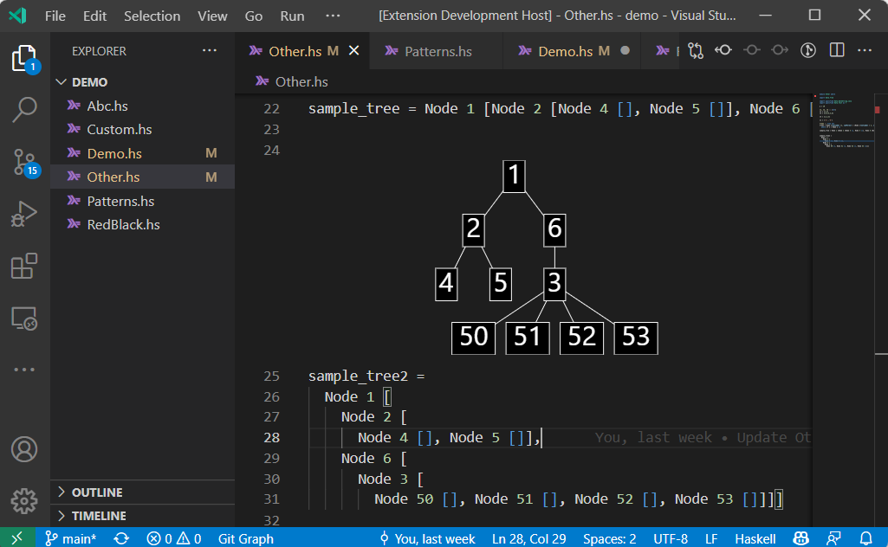

# Interactive Visuals

This extension provides functionality to support interactive visualisation of Haskell code, inline in the editor.
It works in conjunction with Haskell's [`visualisables`] library.

## Demo

## Installation

- Download `interactive-visuals-0.0.1.vsix` from this repository
- Run the `Extensions: Install from VSIX` command in VS Code
